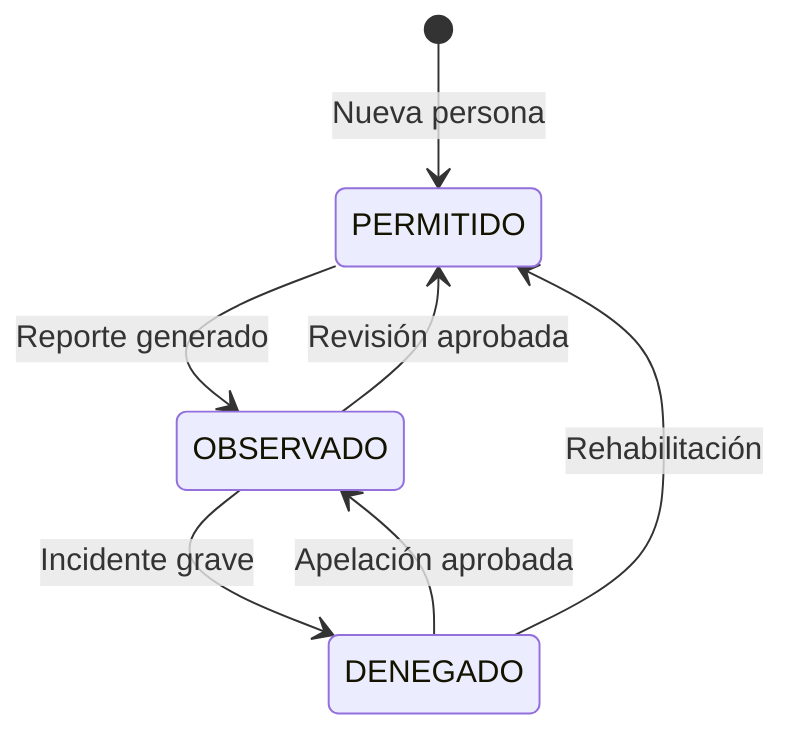

# Estado del proyecto y registro de mejoras — VC-INGRESO

Este documento consolida el **estado frente al plan de trabajo**, los **pendientes por prioridad** y el **historial de mejoras**. El **contrato de la API** está en [server/API.md](server/API.md); el resto del contexto técnico (BD, despliegue, flujos) en [plans/REFERENCIA_TECNICA.md](plans/REFERENCIA_TECNICA.md).

---

## 1. Resumen ejecutivo

**VC-INGRESO** es un sistema de control de acceso residencial con:

- **Entornos**: desarrollo (`docker-compose.dev.yml`), stage (`docker-compose.stage.yml`), producción (`docker-compose.prod.yml` o `docker-compose.prod-rds.yml`). Backup y despliegue: [plans/REFERENCIA_TECNICA.md](plans/REFERENCIA_TECNICA.md) (sección 10).
- **Frontend**: Angular 18 + Angular Material + Tailwind CSS.
- **Backend**: PHP 8.2 + MySQL, API REST en `server/index.php`, controladores en `server/controllers/`.
- **Autenticación**: JWT.

El modelo de datos evolucionó hacia un enfoque **house-centric** (`house_members`, permisos, `GET /api/v1/houses/:id/members`). Parte de la documentación histórica distingue entre “vacío lógico” user ↔ person y el diseño actual con `person_id` en users; ver referencia técnica.

---

## 2. Hito alcanzado: base de datos y backend coherentes

### Base de datos

- **Script principal de esquema**: `database/vc_create_database.sql` crea la BD **vc_db**, tablas (entre otras: houses, users, access_points, persons, vehicles, temporary_visits, access_logs, temporary_access_logs, pets, reservations, house_members según versión del script) y claves foráneas. Init Docker: usuario root y esquema vía `database/init-docker.sh` donde aplique.
- **Datos de prueba**: `database/vc_dev_data.sql`.
- **Licencias Crearttech**: `database/crearttech_clientes_schema.sql` (BD `crearttech_clientes`).

### Backend (API v1)

- Controladores típicos: Auth, User, Person, House, Vehicle, ExternalVehicle, Pet, AccessLog, Reservation, PublicRegistration, Catalog.
- Rutas en `server/index.php`; JWT con `requireAuth()`; registro público sin auth en rutas `public/*`.
- Documentación de endpoints: [server/API.md](server/API.md) (fuente principal); contexto en [plans/REFERENCIA_TECNICA.md](plans/REFERENCIA_TECNICA.md).

### Migración backend (completada según plan)

- Conexión única: `server/db_connection.php` (`getDbConnection()`); `Controller.php` unificado.
- Auth: `POST /api/v1/auth/login` (sustituye flujos legacy tipo `getUser.php`).
- Catálogos: `CatalogController` — áreas, salas, prioridad desde `access_points`; stubs (arrays vacíos o null) para collaborator, personal, payment-by-client, activities-by-user, machines, inc-pendientes, etc., hasta existan datos en vc_db.
- Reportes en `AccessLogController`: entrance-by-range, history-by-date, history-by-range, history-by-client; aforo, address, total-month, total-month-new, hours, age.
- Users/Persons: endpoints como by-doc-number, by-birthday (con JOIN a houses para block/lot donde corresponda), listados destacados según implementación.
- Frontend migrado a servicios que consumen `api/v1/...` (AuthService, UsersService, AccessLogService, EntranceService, etc.).
- **Legacy eliminado** en gran medida: estructura `index.php` + router, `db_connection.php`, controladores, utils, middleware JWT; eliminación masiva de `.php` sueltos por nombre.

---

## 3. Estado actual — Frontend (según plan de trabajo)

### Servicios y componentes integrados

- **Servicios**: ApiService, AuthService, UsersService, PetsService, ReservationsService, AccessLogService, EntranceService. UsersService y AccessLogService alineados con API v1.
- **Componentes**: History (AccessLogService), Birthday (cumpleaños vía API), Pets, Calendar, QrScanner, Webcam; rutas como `/pets`, `/calendar`, `/scanner`; menú actualizado.
- **Formulario de registro público**: secciones UI en [plans/REFERENCIA_TECNICA.md](plans/REFERENCIA_TECNICA.md) (§13); flujo de fotos (§11). Endpoints: [server/API.md](server/API.md) (registro público y uploads).

### Correcciones UI realizadas (plan)

- **Login**: logo con fallback a `assets/logo_VC5.png`; modal de cambio de contraseña con botón visible (`!bg-amber-600 !text-white`).
- **Side-nav / Nav-bar**: avatar por género cuando no hay `photo_url`; nombre, `role_system` y domicilio con fallbacks; logo header.
- **Inicio (dashboard)**: imágenes de puntos de acceso con fallback; datos reales (accesos rápidos, ingresos del día, cumpleaños, reservas próximas) según servicios.

### Refactor frontend — referencia histórica

- Servicios eliminados del scope antiguo: `clientes.service`, `ludopatia.service`, `personal.service`, `systemClient.ts`, `person.ts` (legacy), etc.
- **ListrasComponent**: marcado fuera de scope; sustitución futura por UI de personas unificada.
- Detalle de métodos UsersService / AccessLogService: [plans/REFERENCIA_TECNICA.md](plans/REFERENCIA_TECNICA.md) (§12).

---

## 4. Roadmap por fases (orden sugerido histórico)

### Fase 1 — Cerrar flujos clave

1. **Registro público (UI completa)**: secciones vivienda → propietario(s) → vehículos → mascotas; RENIEC en frontend; `POST /api/v1/public/register`; ruta pública sin login (ej. `/registro`).
2. **Calendario y reservas**: UI Casa Club / Piscina; consumo de `api/v1/reservations` (areas, availability, CRUD).
3. **Mi Casa**: residentes, inquilinos, visitas, vehículos, mascotas, vehículos externos por casa; opcional pestaña Casa Club.
4. **Dashboard Piscina / Aforo**: tiempo real con access-logs y access-points (`current_capacity`, `max_capacity`).

### Fase 2 — Pulir y datos

5. **Subida de fotos**: módulo coherente (vehículos, mascotas, perfil); endpoints y `photo_url` en BD.
6. **Sustituir stubs del Catalog** cuando existan tablas/datos reales.
7. **Licencias / pagos (Crearttech)**: API y UI sobre `crearttech_clientes` (clients, payment).

### Fase 3 — Producción y seguridad

8. **Seguridad**: CSRF en acciones sensibles; rate limiting en login y registro público; HTTPS en despliegue.
9. **Calidad**: OpenAPI/Swagger; tests backend; loading states y retry en frontend; interfaces tipadas.
10. **Limpieza**: eliminar `bd.php`, `bdEntrance.php`, `bdData.php` y referencias a BDs legacy cuando el frontend no las use.

---

## 5. Pendientes por prioridad (checklist del plan)

### Prioridad alta

- [ ] Controlador de **pagos / licencias** (API y UI Crearttech).
- [ ] Completar **UI de Calendario** (reservas Casa Club) y **QR Scanner** (puertas).
- [ ] **Dashboard Piscina / Aforo** en tiempo real.

### Prioridad media

- [ ] **Módulo de gestión de imágenes** (upload, filesystem primero; S3 opcional después).
- [ ] Mejoras de UI: Cumpleaños, Mascotas, Calendario, QR, Aforo-Piscina (crear).
- [ ] Campo **qr_code** en `persons` y generador de QR.
- [ ] Formulario genérico para registros futuros.
- [ ] OpenAPI/Swagger; tests unitarios backend; interfaces tipadas; loading/retry.
- [ ] **Eliminar legacy** de conexiones y BDs antiguas cuando no haya dependencias.

### Seguridad y despliegue

- [ ] Tokens CSRF.
- [ ] Rate limiting API.
- [ ] HTTPS en despliegue.

---

## 6. Estructura objetivo “Mi Casa” (referencia)

```
mi-house/
├── residentes          # Persona tipo RESIDENTE
├── visitas             # Persona tipo VISITA
├── inquilinos          # Persona tipo INQUILINO
├── vehiculos           # Vehículos asociados
├── vehiculos externos  # Visitas temporales
├── mascotas            # Mascotas (por house_id)
├── piscina             # Access point + aforo
├── garita              # Access point
├── formulario          # Registro genérico
└── casa-club           # Reservaciones (calendario)
```

---

## 7. Visión MVP — Escáner unificado (notas del plan)

Versión 1 planteada como **módulo central** que captura lecturas (HID, cámara solo QR, manual DNI/placa), valida, resuelve identidad y registra el evento.

- **HID**: principal para código de barras y QR.
- **Cámara**: solo QR en V1 (sin barras por cámara).
- **Manual**: obligatorio como respaldo.
- **Identificación**: DNI/personas, placa vehículo, QR del sistema (permanente o temporal/regenerable).
- **Generación de credenciales**: desde UI de usuario/visita (QR/barcode opcional); OCR/LPR pospuesto.

---

## 8. Diagrama de estados de personas

Estados: `PERMITIDO` (default), `OBSERVADO`, `DENEGADO`.



---

## 9. Notas de negocio y documentación (del plan)

- Mantener compatibilidad con endpoints legacy hasta migración total del frontend.
- **Propietario**: históricamente en tabla Users; conviene revisar flujo Persons vs Users frente a `house_members`.
- **Registro**: si una casa ya tiene propietario, no debería ofrecerse en desplegables de nuevo registro (reducir opciones según datos existentes).
- Refactor de servicios y componentes: resumido en [plans/REFERENCIA_TECNICA.md](plans/REFERENCIA_TECNICA.md) (§12).
- **Futuro**: panel de suscripción Crearttech y VC5.

---

## 10. Registro de mejoras implementadas (marzo 2026 — contenido temático)

### Fechas de registro

- **2026-03-16**: mejoras base (tablas, fotos, backend house members, domicilio en listados).
- **2026-03-18**: carga de fotos en mascotas/vehículos y estandarización de modales.

### 10.1 Mi Casa — Tablas (Residentes, Inquilinos, Mascotas, Vehículos)

- Columna **Foto** en las cuatro tablas.
- Renderizado: si existe `photo_url`, ``; si no, placeholder circular con `mat-icon` (person / pets / directions_car).
- Acciones: `visibility` (vista), `edit` (edición).

### 10.2 Modal de vista de foto en `my-house`

- Estilos: `.photo-view-overlay`, `.photo-view-modal`, `.photo-view-header`, `.photo-view-img`.
- Métodos: `openViewPhoto(item, title)`, `closeViewPhoto()`.

### 10.3 Corrección TS2341 (`api` pública)

- En `my-house.component.ts`: `private api: ApiService` → `public api: ApiService` para uso desde plantilla si aplica.

### 10.4 Backend `HouseController::members`

- SELECT incluye `p.photo_url` en joins de `house_members` y fallback por `house_id` en persons, para mostrar foto desde `persons.photo_url`.

### 10.5 `canAccessHouse` y fallback `house_id`

- Lógica de acceso: token `house_id`, tabla `house_members`, fallback `persons.house_id`.

### 10.6 Vehicles — Domicilio (Mz/Lt/Dpto)

- `getHouseLocation(v)` en `vehicles.component.ts`: busca `house` en `houses`, fallback `block_house` / `lot` / `apartment`, formato `MZ:… LT:… DPTO:…`, mayúsculas.
- Plantilla: `{{ getHouseLocation(v) }}`.

### 10.7 Users — Domicilio y mayúsculas

- `getHouseLocation(u)` análogo a vehículos.
- Nombre en mayúsculas con `toUpperCase()` donde se aplicó.

### 10.8 Actualización 2026-03-18 — Mascotas y vehículos (cámara)

- Botón de cámara en acciones de tablas de mascotas y vehículos.
- Inputs `file` por fila; eventos `(change)` a métodos dedicados.
- `PublicRegistrationService` reutilizado para subida.
- Métodos: `onVehiclePhotoSelect`, `onPetPhotoSelect`.
- Estado: `uploadingVehicleIndex`, `uploadingPetIndex`.

### 10.9 Estandarización de modales (2026-03-18)

- Modales revisados: Residentes, Inquilinos, Mascotas, Vehículos, Visitas, Vehículos externos.
- Inputs: `Celular` como `type="text"` donde correspondía; fecha de nacimiento en visitas como `type="date"`.
- Título “Editar usuario” en modal de edición de usuario.
- Visitas: categoría vía `categories_visits`.
- Campos añadidos: vehículos — Marca, Modelo, Color; mascotas — Edad, Especie (select), Color (select), Estado; residentes/inquilinos homogeneizados (Usuario, Rol, Estado de Rol, Domicilio).
- Listas: `vehicleColors`, `petColors` en `my-house.component.ts`.

### 10.10 Modelo `Vehicle`

- `vehicle.ts`: propiedades opcionales `brand`, `model`, `color`.
- Inicialización de `vehicleToAdd` / `vehicleToEdit` actualizada.

### 10.11 Validación

- Verificación en `my-house.component.ts` / `.html` sin errores de compilación reportados tras cambios.
- Recomendación: `ng serve` o `npm test` para validación UI.

---

## 11. Documentación del repositorio

| Archivo | Contenido |
|---------|-----------|
| [README.md](README.md) | Entrada al proyecto e instalación rápida |
| [server/API.md](server/API.md) | Contrato REST v1 (rutas y cuerpos; alineado a `index.php`) |
| Este archivo | Estado, roadmap, pendientes, mejoras implementadas |
| [plans/REFERENCIA_TECNICA.md](plans/REFERENCIA_TECNICA.md) | Bases de datos, flujos, deploy, modelos, contexto ampliado |

---

*Para nuevos entornos prevalece `database/vc_create_database.sql` (+ `vc_dev_data.sql` en desarrollo). Detalle en la referencia técnica §4.*
