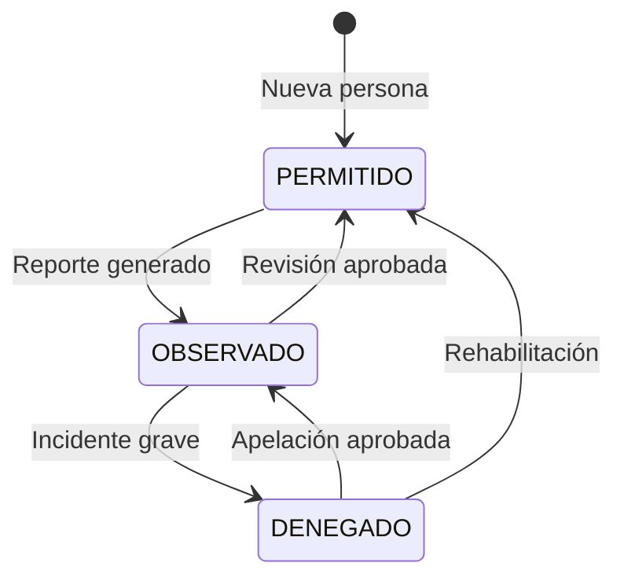

# Plan de Trabajo VC-INGRESO

## Resumen del Proyecto

**VC-INGRESO** es un sistema de control de acceso residencial con:

- **Entorno**: Desarrollo (docker-compose.dev.yml), Stage (docker-compose.stage.yml), Producción (docker-compose.prod.yml o docker-compose.prod-rds.yml). Ver [DEPLOY.md](../DEPLOY.md).
- **Frontend**: Angular 18 + Angular Material + Tailwind CSS
- **Backend**: PHP 8.2 + MySQL, API REST en `server/index.php`, controladores en `server/controllers/`
- **Autenticación**: JWT

---

## Hito: Base de datos y backend coherentes (estado actual)

### Base de datos

- **Un solo script de esquema**: `database/vc_create_database.sql` crea la BD **vc_db**, tablas (houses, users, access_points, persons, vehicles, temporary_visits, access_logs, temporary_access_logs, pets, reservations) y claves foráneas. Init Docker: root@'%' y esquema vía `database/init-docker.sh`.
- **Datos de prueba**: `database/vc_dev_data.sql`. **Licencias**: `database/crearttech_clientes_schema.sql` (BD crearttech_clientes).
- Ver [BASES_DE_DATOS.md](BASES_DE_DATOS.md).

### Backend (API v1)

- Controladores: UserController, HouseController, VehicleController, PersonController, ExternalVehicleController, PetController, AccessLogController, ReservationController. Rutas en `server/index.php`; access-logs (access-points, stats/daily). Documentación: `server/API.md`.

---

## Estado actual – Completado

### Backend (PHP)

- Controladores MVC para users, houses, vehicles, persons, external-vehicles, pets, access-logs, reservations.
- Rutas centralizadas en `server/index.php`; JWT con `requireAuth()`.
- UserController byBirthday con JOIN a houses (block_house, lot).

### Frontend (Angular) – Refactor integrado

- **Servicios**: ApiService, AuthService, UsersService, PetsService, ReservationsService, AccessLogService, EntranceService. UsersService y AccessLogService consolidados con API v1; eliminados clientes.service, ludopatia.service, personal.service, systemClient.ts, person.ts (legacy).
- **Componentes**: History (AccessLogService), Birthday (getPersonsByBirthday), Pets, Calendar, QrScanner, Webcam; rutas /pets, /calendar, /scanner; menú actualizado. CookieService eliminado; AuthService para token y estado.
- **Formulario de registro público**: Definido en [REFACTORIZACION_FRONTEND.md](REFACTORIZACION_FRONTEND.md) (secciones propietarios, vehículos, mascotas; photo_url en vehículos y mascotas).

### Correcciones UI realizadas

- **Login**: Logo con fallback a `assets/logo_VC5.png`; modal de cambio de contraseña con botón visible (!bg-amber-600 !text-white).
- **Side-nav y Nav-bar**: Avatar por género (`assets/user-female.png` / `assets/user-male.png`) cuando no hay photo_url; nombre, role_system y domicilio con fallbacks (getUserDisplayName, getUserDomicilio en AppComponent); logo header a `assets/logo_VC5wFondo.png`.
- **Inicio (dashboard)**: Imágenes de puntos de acceso con fallback a `assets/logo_VC5.png`.

### Dashboard (inicio) refactorizado

- Dashboard sencillo con datos reales: accesos rápidos (Historial, Calendario, Cumpleaños, Mi casa), ingresos del día (access-logs), cumpleaños de hoy (by-birthday), próximas reservas (primeras 5). Carga vía AccessLogService, UsersService.getPersonsByBirthday, ReservationsService.getByDateRange.

### Base de datos (documentación)

- [BASES_DE_DATOS.md](BASES_DE_DATOS.md) con vc_create_database.sql, vc_dev_data.sql, crearttech_clientes_schema.sql; DB_LICENSE_NAME=crearttech_clientes.

---

## Pendientes – Prioridad alta

- [ ] **Controlador de pagos / licencias**: API y UI para gestionar clientes Crearttech y períodos de licencia (CRUD clients, payment).
- [ ] Completar **UI de Calendario** (reservas Casa Club) y de **QR Scanner** (puertas).
- [ ] **Dashboard Piscina / Aforo**: Pantalla de aforo en tiempo real (access-logs/access-points, current_capacity).

---

## Pendientes – Prioridad media

- [ ] **Módulo de gestión de imágenes**: Upload de fotos (vehículos, mascotas en formulario de ingreso; foto de perfil). Almacenamiento: servidor (filesystem) primero; opción S3 después. Endpoints upload y actualización de photo_url en BD.
- [ ] **UIs por mejorar**: Cumpleaños (presentación/filtros), Mascotas (listado y formularios; alinear con API v1 y subida de foto), Calendario, QR, Aforo-Piscina (crear).
- [ ] Campo **qr_code** en tabla persons y endpoint generador de QR.
- [ ] Formulario genérico para registros futuros.
- [ ] Documentación OpenAPI/Swagger; tests unitarios backend; interfaces tipadas; loading states; retry en fallos.
- [ ] **Eliminar legacy**: bd.php, bdEntrance.php, bdData.php y get*.php que los usan; eliminar BDs vc_entrance y vc_data cuando el frontend no dependa de ellos.

---

## Pendientes – Seguridad y despliegue

- [ ] CSRF tokens.
- [ ] Rate limiting para API.
- [ ] HTTPS en despliegue.

---

## Referencia de endpoints API v1

Ver **`server/API.md`**. Resumen:

| Recurso            | CRUD | Endpoints especiales |
|--------------------|------|------------------------|
| users              | Sí   | by-birthday            |
| houses             | Sí   | —                      |
| vehicles           | Sí   | by-house               |
| persons            | Sí   | by-doc-number, observed, restricted, validate |
| external-vehicles  | Sí   | —                      |
| pets               | Sí   | person/:id, validate, photo |
| access-logs        | List/Create/Show | access-points, stats/daily |
| reservations       | Sí   | areas, availability, status |

---

## Estructura objetivo "Mi Casa"

```
mi-house/
├── residentes          # Persona tipo RESIDENTE
├── visitas             # Persona tipo VISITA
├── inquilinos          # Persona tipo INQUILINO
├── vehiculos           # Vehículos asociados
├── vehiculos externos  # Visitas temporales
├── mascotas            # Mascotas (por house_id)
├── piscina             # Access point + aforo
├── garita              # Access point
├── formulario          # Registro genérico
└── casa-club           # Reservaciones (calendario)
```

---

## Diagrama de estados de personas



---

## Notas

- Mantener compatibilidad con endpoints legacy hasta que el frontend esté completamente migrado.
- **REFACTORIZACION_FRONTEND.md** queda integrado en este plan; se puede conservar como referencia histórica del refactor de servicios y componentes.
- **Más adelante**: Panel de suscripción para Crearttech (clientes, licencias, pagos) y para VC5 (información de suscripción).
- **Propietario**: Se registra en tabla Users, no en persons; revisar flujo Persons vs Users.
- **Formulario de registro**: Si una casa ya tiene propietario registrado, no debería aparecer en el desplegable; ir reduciendo opciones según registros existentes.
