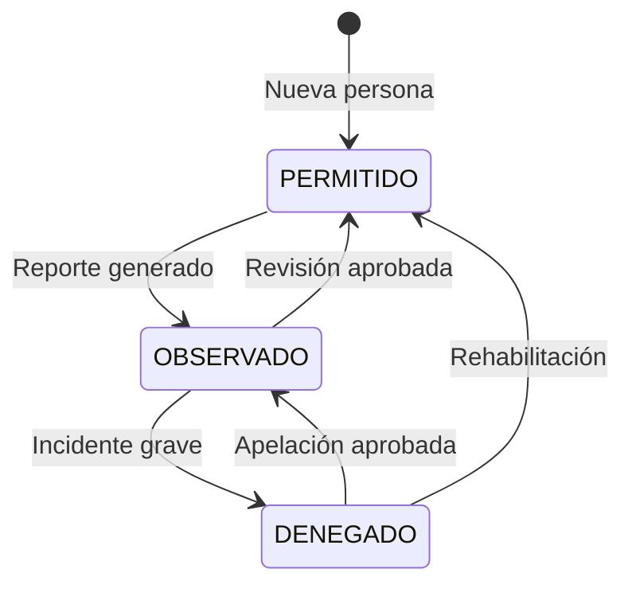

# Plan de Trabajo VC-INGRESO

## Resumen del Proyecto

**VC-INGRESO** es un sistema de control de acceso residencial con:

- **Entorno**: Desarrollo y pruebas con **docker-compose** (Node, PHP, MySQL). Ver README para `docker compose up --build`.
- **Frontend**: Angular 18 + Angular Material + Tailwind CSS
- **Backend**: PHP 8.2 + MySQL, API REST en `server/index.php`, controladores en `server/controllers/`
- **Autenticación**: JWT

Refactor frontend: [REFACTORIZACION_FRONTEND.md](REFACTORIZACION_FRONTEND.md).

---

## Hito: Base de datos y backend coherentes (estado actual)

### Base de datos

- **Un solo script de esquema**: `database/vc_create_database.sql` crea la BD **vc_db**, todas las tablas (houses, users, access_points, persons, vehicles, temporary_visits, access_logs, temporary_access_logs, **pets**, **reservations**) y **todas las claves foráneas**. No existe ya `vc_foreign_keys.sql` por separado; está unificado.
- **Datos de prueba**: `database/vc_dev_data.sql` (ejecutar después de `vc_create_database.sql`).
- **Licencias**: `database/crearttech_clientes_schema.sql` para la BD de clientes Crearttech.
- **Migraciones eliminadas**: Se eliminaron `access_logs_migration.sql`, `pets_migration.sql`, `reservations_migration.sql`, `vc_rename_sala_to_puerta.sql`, `vc_pets_add_house_id.sql`. El esquema actual está solo en `vc_create_database.sql`.
- **Pets**: Tabla con **house_id** obligatorio y **owner_id** opcional; la gestión de mascotas es por casa. Ver [BASES_DE_DATOS.md](BASES_DE_DATOS.md).

### Backend (API v1)

- **Controladores** en `server/controllers/`: UserController, HouseController, VehicleController, PersonController, ExternalVehicleController, **PetController**, **AccessLogController**, **ReservationController**. Todos con `requireAuth()` donde corresponde.
- **Rutas** en `server/index.php`: users (CRUD + by-birthday), houses, vehicles (CRUD + by-house), persons (CRUD + by-doc-number, observed, restricted, validate), external-vehicles, **pets** (CRUD + person/:id, validate, photo), **access-logs** (index, show, store, access-points, stats/daily), **reservations** (CRUD + areas, availability, status).
- **PetController**: Lee body JSON en POST/PUT/validate con `getInput()`; creación de mascota exige `name`, `species`, `house_id`.
- **Conexión**: `server/db_connection.php` con `getDbConnection()`; controladores que no extienden `Controller` (PetController, AccessLogController, ReservationController) reciben PDO o lo obtienen vía `getDbConnection()`.
- **CORS y OPTIONS**: Enviados desde `server/index.php`; no depender de .htaccess para CORS.
- **Documentación API**: `server/API.md` con todos los endpoints y nota para crear nuevos CRUD.

### Coherencia y listo para producción (revisión)

- **Base de datos**: Un solo script de creación con FKs; sin migraciones dispersas. **Coherente.**
- **API**: CRUD homogéneos; pets y reservations con body JSON; by-birthday devuelve domicilio (block_house, lot). **Funcional.**
- **Pendiente para producción** (no bloquea el hito): CSRF, rate limiting, HTTPS, tests automatizados, OpenAPI/Swagger.

---

## Estado actual – Completado

### Backend (PHP)

- Controladores MVC para users, houses, vehicles, persons, external-vehicles, pets, access-logs, reservations.
- Rutas centralizadas en `server/index.php`; mensaje 404 con lista de rutas disponibles.
- Autenticación JWT con `requireAuth()` en los controladores nuevos.
- PetController con `getInput()` para POST/PUT/validate.
- UserController byBirthday con JOIN a houses (block_house, lot) y sin enviar password.

### Frontend (Angular)

- Servicios: ApiService, AuthService, UsersService, PetsService, ReservationsService, AccessLogService, EntranceService.
- Componentes: History, Birthday, Pets, Calendar, QrScanner, Webcam; eliminados listas/ y upload/.
- Cumpleaños: fecha de nacimiento por fila y domicilio Mz/Lt desde API.
- Mascotas: columna Casa (house_id), formulario con casa obligatoria; owner_id opcional en backend.
- Rutas: /pets, /calendar, /scanner; menú lateral actualizado.
- CookieService eliminado; uso de AuthService para token y estado.

### Base de datos (documentación)

- [BASES_DE_DATOS.md](BASES_DE_DATOS.md) actualizado: solo vc_create_database.sql, vc_dev_data.sql, crearttech_clientes_schema.sql; orden de ejecución y descripción de tablas vc_db.

---

## Pendientes – Prioridad alta

- [ ] **Controlador de pagos / licencias**: API y UI para gestionar clientes Crearttech y períodos de licencia (CRUD clients, payment).
- [ ] Completar **UI de Calendario** (reservas Casa Club) y de **QR Scanner** (puertas).
- [ ] **Dashboard Piscina** (aforo en tiempo real con access-logs/access-points).

---

## Pendientes – Prioridad media

- [ ] Campo **qr_code** en tabla persons y endpoint generador de QR.
- [ ] Formulario genérico para registros futuros.
- [ ] Documentación OpenAPI/Swagger; tests unitarios backend.
- [ ] Interfaces tipadas para todas las respuestas; loading states; retry en llamadas fallidas.
- [ ] **Eliminar legacy**: bd.php, bdEntrance.php, bdData.php y get*.php que los usan; eliminar BDs vc_entrance y vc_data cuando el frontend no dependa de ellos.

---

## Pendientes – Seguridad y despliegue

- [ ] CSRF tokens.
- [ ] Rate limiting para API.
- [ ] HTTPS en despliegue.

---

## Referencia de endpoints API v1

Ver **`server/API.md`** para la lista completa. Resumen por recurso:

| Recurso            | CRUD | Endpoints especiales |
|--------------------|------|------------------------|
| users              | Sí   | by-birthday            |
| houses             | Sí   | —                      |
| vehicles           | Sí   | by-house               |
| persons            | Sí   | by-doc-number, observed, restricted, validate |
| external-vehicles  | Sí   | —                      |
| pets               | Sí   | person/:id, validate, photo |
| access-logs        | List/Create/Show | access-points, stats/daily |
| reservations       | Sí   | areas, availability, status |

---

## Estructura objetivo "Mi Casa"

```
mi-house/
├── residentes          # Persona tipo RESIDENTE
├── visitas             # Persona tipo VISITA
├── inquilinos          # Persona tipo INQUILINO
├── vehiculos           # Vehículos asociados
├── vehiculos externos  # Visitas temporales
├── mascotas            # Mascotas (por house_id)
├── piscina             # Access point + aforo
├── garita              # Access point
├── formulario          # Registro genérico
└── casa-club           # Reservaciones (calendario)
```

---

## Diagrama de estados de personas



---

## Notas

- Mantener compatibilidad con endpoints legacy hasta que el frontend esté completamente migrado.
- **PENDIENTES.md** queda sustituido por este documento; usar solo este archivo para estado y pendientes del proyecto.

--- Más adelante añadir 
-Panel de suscripción para Crearttech (para que vea sus clientes, licencias, suscripciones, pagos, etc) y para VC5 (para que vea la información de sus suscripción)
--
Propietario (Esto se registra en la tabla Users no en la tabla persons):
Problema de base de datos Persons vs Users 

---
En el formulario, si alguien ya se registra como propietario en una house, esta casa ya no debería estar disponible en el desplegable. Es decir a medida que van habiendo registros, los desplegables disponibles deberían reducirse. 