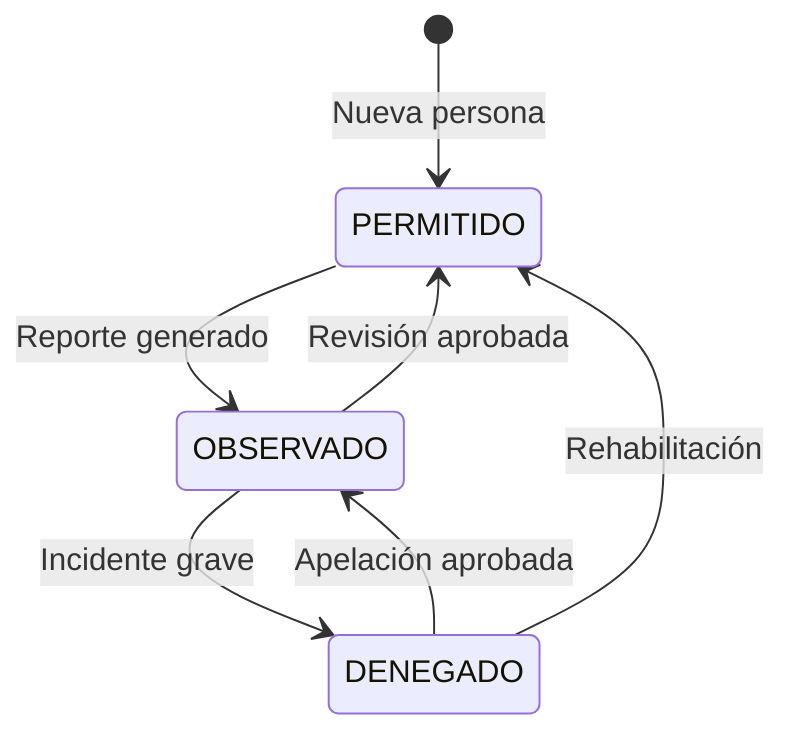

# Plan de Trabajo VC-INGRESO

## Resumen del Proyecto

**VC-INGRESO** es un sistema de control de acceso residencial con:

- **Entorno**: Desarrollo (docker-compose.dev.yml), Stage (docker-compose.stage.yml), Producción (docker-compose.prod.yml o docker-compose.prod-rds.yml). Ver [DEPLOY.md](../DEPLOY.md).
- **Frontend**: Angular 18 + Angular Material + Tailwind CSS
- **Backend**: PHP 8.2 + MySQL, API REST en `server/index.php`, controladores en `server/controllers/`
- **Autenticación**: JWT

---

## Hito: Base de datos y backend coherentes (estado actual)

### Base de datos

- **Un solo script de esquema**: `database/vc_create_database.sql` crea la BD **vc_db**, tablas (houses, users, access_points, persons, vehicles, temporary_visits, access_logs, temporary_access_logs, pets, reservations) y claves foráneas. Init Docker: root@'%' y esquema vía `database/init-docker.sh`.
- **Datos de prueba**: `database/vc_dev_data.sql`. **Licencias**: `database/crearttech_clientes_schema.sql` (BD crearttech_clientes).
- Ver [BASES_DE_DATOS.md](BASES_DE_DATOS.md).

### Backend (API v1)

- Controladores: UserController, HouseController, VehicleController, PersonController, ExternalVehicleController, PetController, AccessLogController, ReservationController. Rutas en `server/index.php`; access-logs (access-points, stats/daily). Documentación: `server/API.md`.

---

## Estado actual – Completado

### Migración backend (hecha)

- **Conexión única**: `server/db_connection.php` (getDbConnection()); `Controller.php` ya no define su propia conexión.
- **Auth**: AuthController – POST /api/v1/auth/login (sustituye getUser.php).
- **Catálogos**: CatalogController – GET catalog/areas, catalog/salas, catalog/prioridad (desde access_points); stubs para collaborator, personal, payment-by-client, activities-by-user, machines, inc-pendientes, etc., que devuelven [] o null hasta tener datos en vc_db.
- **Reportes en AccessLogController**: entrance-by-range, history-by-date, history-by-range, history-by-client; aforo, address, total-month, total-month-new, hours, age (sobre access_logs).
- **Users/Persons**: UserController byDocNumber (GET users/by-doc-number); PersonController listByBirthday, destacados.
- **Frontend**: auth.service → POST /api/v1/auth/login; users.service y access-log.service → api/v1/...; entrance.service → houses, vehicles, persons por casa a api/v1; resto a catalog/...
- **Legacy eliminado**: ya no se cargan .php por nombre en index.php; eliminados get*.php, post*.php, update*.php, delete*.php, vc_db.php (56 archivos). Estructura: index.php + router.php, db_connection.php, controllers/, utils/, auth_middleware, token, sanitize, error-handler.

### Backend (PHP) – estado actual

- Controladores: Auth, User, Person, House, Vehicle, ExternalVehicle, Pet, AccessLog, Reservation, PublicRegistration, Catalog.
- Rutas en `server/index.php`; JWT con `requireAuth()`; registro público sin auth.
- UserController byBirthday con JOIN a houses (block_house, lot).

### Frontend (Angular) – Refactor integrado

- **Servicios**: ApiService, AuthService, UsersService, PetsService, ReservationsService, AccessLogService, EntranceService. UsersService y AccessLogService consolidados con API v1; eliminados clientes.service, ludopatia.service, personal.service, systemClient.ts, person.ts (legacy).
- **Componentes**: History (AccessLogService), Birthday (getPersonsByBirthday), Pets, Calendar, QrScanner, Webcam; rutas /pets, /calendar, /scanner; menú actualizado. CookieService eliminado; AuthService para token y estado.
- **Formulario de registro público**: Definido en [REFACTORIZACION_FRONTEND.md](REFACTORIZACION_FRONTEND.md) (secciones propietarios, vehículos, mascotas; photo_url en vehículos y mascotas).

### Correcciones UI realizadas

- **Login**: Logo con fallback a `assets/logo_VC5.png`; modal de cambio de contraseña con botón visible (!bg-amber-600 !text-white).
- **Side-nav y Nav-bar**: Avatar por género (`assets/user-female.png` / `assets/user-male.png`) cuando no hay photo_url; nombre, role_system y domicilio con fallbacks (getUserDisplayName, getUserDomicilio en AppComponent); logo header a `assets/logo_VC5wFondo.png`.
- **Inicio (dashboard)**: Imágenes de puntos de acceso con fallback a `assets/logo_VC5.png`.

### Dashboard (inicio) refactorizado

- Dashboard sencillo con datos reales: accesos rápidos (Historial, Calendario, Cumpleaños, Mi casa), ingresos del día (access-logs), cumpleaños de hoy (by-birthday), próximas reservas (primeras 5). Carga vía AccessLogService, UsersService.getPersonsByBirthday, ReservationsService.getByDateRange.

### Base de datos (documentación)

- [BASES_DE_DATOS.md](BASES_DE_DATOS.md) con vc_create_database.sql, vc_dev_data.sql, crearttech_clientes_schema.sql; DB_LICENSE_NAME=crearttech_clientes.

---

## Cómo seguimos con el proyecto

Orden sugerido para los próximos sprints:

### Fase 1 – Cerrar flujos clave (prioridad inmediata)

1. **Formulario de registro público (sin login)**  
   - UI completa por secciones (vivienda → propietario 1 → propietario 2 opcional → vehículos 1–3 → mascotas 1–2).  
   - Llamada a RENIEC por DNI para autocompletar; envío final a `POST /api/v1/public/register`.  
   - Ruta pública (ej. `/registro` o `/registro-propietario`) sin pasar por login.

2. **Calendario y reservas**  
   - Completar UI de reservas (Casa Club / Piscina): listado, creación, edición, estados.  
   - Consumir `api/v1/reservations` (areas, availability, CRUD).

3. **Mi Casa**  
   - Dejar operativos residentes, inquilinos, visitas, vehículos, mascotas, vehículos externos por casa (datos desde api/v1).  
   - Opcional: pestaña “Casa Club” en Mi Casa que enlace al calendario de reservas.

4. **Dashboard Piscina / Aforo**  
   - Pantalla de aforo en tiempo real usando access-logs y access-points (current_capacity, max_capacity).

### Fase 2 – Pulir y datos

5. **Subida de fotos**  
   - Módulo de imágenes: vehículos, mascotas, foto de perfil.  
   - Endpoints de upload y actualización de `photo_url` en BD (ya existen en pets; extender a vehicles y users).

6. **Sustituir stubs del Catalog**  
   - Cuando existan tablas o datos en vc_db para collaborator, payment-by-client, activities-by-user, etc., reemplazar en CatalogController la respuesta []/null por la lógica real.

7. **Licencias / Pagos (Crearttech)**  
   - API y UI para CRUD de clientes y períodos de licencia (tablas clients, payment en crearttech_clientes).  
   - Opcional: quitar dependencia de bdLicense.php usando solo api/v1.

### Fase 3 – Producción y seguridad

8. **Seguridad**  
   - CSRF en acciones sensibles; rate limiting en login y registro público; HTTPS en despliegue.

9. **Calidad y documentación**  
   - OpenAPI/Swagger; tests unitarios backend; loading states y retry en frontend; interfaces tipadas para respuestas.

10. **Limpieza final**  
    - Eliminar bd.php, bdEntrance.php, bdData.php y cualquier referencia a vc_entrance / vc_data cuando el frontend ya no los use.

**Siguiente paso concreto:** Implementar la UI del formulario de registro público (Fase 1.1) y conectar RENIEC + `POST /api/v1/public/register`. El backend para ese flujo ya está listo.

---

## Pendientes – Prioridad alta

- [ ] **Controlador de pagos / licencias**: API y UI para gestionar clientes Crearttech y períodos de licencia (CRUD clients, payment).
- [ ] Completar **UI de Calendario** (reservas Casa Club) y de **QR Scanner** (puertas).
- [ ] **Dashboard Piscina / Aforo**: Pantalla de aforo en tiempo real (access-logs/access-points, current_capacity).

---

## Pendientes – Prioridad media

- [ ] **Módulo de gestión de imágenes**: Upload de fotos (vehículos, mascotas en formulario de ingreso; foto de perfil). Almacenamiento: servidor (filesystem) primero; opción S3 después. Endpoints upload y actualización de photo_url en BD.
- [ ] **UIs por mejorar**: Cumpleaños (presentación/filtros), Mascotas (listado y formularios; alinear con API v1 y subida de foto), Calendario, QR, Aforo-Piscina (crear).
- [ ] Campo **qr_code** en tabla persons y endpoint generador de QR.
- [ ] Formulario genérico para registros futuros.
- [ ] Documentación OpenAPI/Swagger; tests unitarios backend; interfaces tipadas; loading states; retry en fallos.
- [ ] **Eliminar legacy**: bd.php, bdEntrance.php, bdData.php y get*.php que los usan; eliminar BDs vc_entrance y vc_data cuando el frontend no dependa de ellos.

---

## Pendientes – Seguridad y despliegue

- [ ] CSRF tokens.
- [ ] Rate limiting para API.
- [ ] HTTPS en despliegue.

---

## Referencia de endpoints API v1

Ver **`server/API.md`**. Resumen:

| Recurso            | CRUD | Endpoints especiales |
|--------------------|------|------------------------|
| users              | Sí   | by-birthday            |
| houses             | Sí   | —                      |
| vehicles           | Sí   | by-house               |
| persons            | Sí   | by-doc-number, observed, restricted, validate |
| external-vehicles  | Sí   | —                      |
| pets               | Sí   | person/:id, validate, photo |
| access-logs        | List/Create/Show | access-points, stats/daily |
| reservations       | Sí   | areas, availability, status |

---

## Estructura objetivo "Mi Casa"

```
mi-house/
├── residentes          # Persona tipo RESIDENTE
├── visitas             # Persona tipo VISITA
├── inquilinos          # Persona tipo INQUILINO
├── vehiculos           # Vehículos asociados
├── vehiculos externos  # Visitas temporales
├── mascotas            # Mascotas (por house_id)
├── piscina             # Access point + aforo
├── garita              # Access point
├── formulario          # Registro genérico
└── casa-club           # Reservaciones (calendario)
```

---

## Diagrama de estados de personas



---

## Notas

- Mantener compatibilidad con endpoints legacy hasta que el frontend esté completamente migrado.
- **REFACTORIZACION_FRONTEND.md** queda integrado en este plan; se puede conservar como referencia histórica del refactor de servicios y componentes.
- **Más adelante**: Panel de suscripción para Crearttech (clientes, licencias, pagos) y para VC5 (información de suscripción).
- **Propietario**: Se registra en tabla Users, no en persons; revisar flujo Persons vs Users.
- **Formulario de registro**: Si una casa ya tiene propietario registrado, no debería aparecer en el desplegable; ir reduciendo opciones según registros existentes.
- **Escaner QR**: PROMPT:
Me lo estoy planteando así para la Versión 1 (MVP):

Módulo de ingreso unificado (Scanner): será el “módulo central” que captura lecturas desde distintas fuentes y las envía al backend para detectar el tipo, validar, resolver la identidad y registrar el evento.

Debe soportar:

Lector USB tipo HID/keyboard wedge (principal): lectura confiable de código de barras y QR (según soporte del lector).

Cámara del equipo host (secundaria): lectura solo de QR (en V1 no se incluye lectura de barras por cámara).

Ingreso manual (fallback obligatorio): ingreso de documento o placa cuando el escaneo falle o no exista lector/cámara.

Qué puede ingresar/identificar en V1:

Documento (DNI u otro): puede corresponder a personas registradas o no registradas; si no existe en el sistema, debe permitir flujo de registro/validación según estatus.

Placa de vehículo: si está registrada, se resuelve; si no está registrada, se permite registro rápido manual (sin OCR/LPR en V1).

QR generado por el sistema: credenciales internas sin PII, basadas en token firmado, con dos modalidades:

Permanente (credencial fija asociada a usuario/vehículo).

Temporal/regenerable (con expiración y posibilidad de revocación; opcional “one-time use”).

Generación de credenciales en la UI:

Desde la vista del usuario/visita, el sistema debe permitir generar y mostrar un QR (y opcionalmente un código de barras si aplica), ya sea permanente o temporal/regenerable.

Con esto busco un MVP confiable para portería: HID como entrada principal, cámara solo para QR y manual como respaldo, dejando OCR/LPR para una versión posterior.